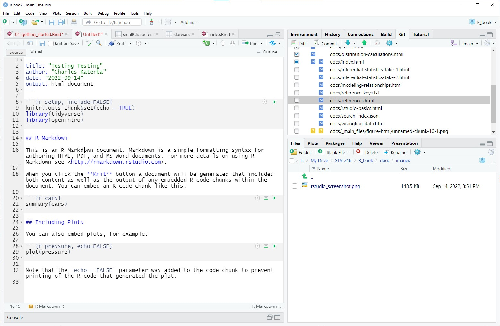

# RStudio basics

At this point you should have an operational RStudio terminal at your disposal.  If not, go back to [Getting started].  This chapter will focus some of the most basic tools and skills you'll need to successfully use RStudio. We'll start with using R as a calculator, learn about naming and storing values/objects, then progress to loading and using data frames (the bread and butter of R in some sense), and finish with R Markdown documents, which allow you to create fully reproducible documents that contain a mixture of text and code.  Fun fact: these notes were written in a collection of RMarkdown documents and compiled with a package called `bookdown`.  

As you proceed, we encourage you to try to run any code you see in this book and to play around and do things on your own. The best way to learn how to code is to experiment. The immediate feedback of running some successful code can be quite gratifying!

## A big calculator

At its most basic, R is a big, fancy, and initially cumbersome calculator. Think of any calculation you'd like to do and R can likely do it. R can handle more than just numbers!  For our purposes, we'll need numbers, strings, and logicals.   

### Numbers

R has three "atomic" types of numbers: real, integer, and complex, but we will only need to think of real numbers.  You can do arithmetic and evaluate the standard elementary functions with numbers as you would expect.

- Addition, multiplication, subtraction, and division are `+`, `*`, `-`, and `/` respectively. For example: 

```{r}
2 + 2
3 * 1.5
9 - 4
5/3
```

- Exponentiation is either `^` or `**`, the latter is old school. You can raise a number to a power of 10 using scientific notation, for example `1.2e4` is 12000. 

```{r}
2^3
2**3
1.2e4
```
- All of your favorite "elementary" functions are built into R. Note that the `log` function is base $e$, not base 10.  The example below shows how to change base.

```{r}
exp(2) # e^2
sin(pi/2) # note the trig functions are in radians
log(10) # natural log of 10
log(100, 10) # the log of 100, base 10
```
**Reminder!** Be careful and mindful about the order of operations; computers and calculators read your input very literally. For instance, $6 \div 2(1 + 2)$, is an annoying statement with respect to the order of operations. R will evaluate this expression correctly if you type `6/2*(1+2)`. Make sure you can evaluate it correctly as well so that you input what you mean.

### Strings

We want to be able to analyze both numerical and categorical variables in R.  For this reason, along with many others, your can use and manipulate strings of character in R. We won't be doing much more than using strings for values of categorical variables, so we won't go into too much detail. 

To define a string, simply put the expression in question in quotation marks.

```{r, eval=F}
"R might be cool? I don't know."
```

Base R has some handy functions for manipulating strings. We may not need all of them, but they're good to be aware of. 

- `substr(string, start=n1, stop=n2)` will return a subset of your string starting at the `n1`th character, ending at the `n2` character. 

```{r}
substr("R might be cool? I don't know.", start = 18, stop = 30)
```

- `nchar(string)` counts the number of characters in a string. 

```{r}
nchar("R might be cool? I don't know.")
```

- `toupper/tolower(string)` converts all letters to either upper or lower case. 

```{r}
toupper("R might be cool? I don't know.")
```

- `paste(..., sep = " ")` will concatenate a collection of strings, separated by a space. You can change what separates the strings. This function is most useful when you have to repeatedly concatenate some strings.  

```{r}
paste("R might be cool? I don't know.", "Yes, it is!")
```

You can do a lot more with strings, but things start to get more complicated quickly.  The package `stringr` has some really handy functions, but are unnecessary for this course. 

### Logicals and Logical operators

Throughout this class you will need to compare various objects in R using standard "logical operators" like "equals" (`==`), "less than" `<`, "greater than or equal to `>=`" etc. When you compare objects using these operators, R returns a new type of object called a "logical". Logicals are just `TRUE` and `FALSE`. 

- You can check equality of numbers and strings using `==`. To check if two objects are unequal, use `!=`.

```{r}
4 == 5
2^3 == 8
"cat" == "dog"
"dog" != "cat"
```

- You can compare numbers with your favorite inequalities (`<`, `>`, `<=`, `>=`) as well. More interestingly, you can also compare strings with inequalities. R defaults to lexicographic (ie dictionary) ordering of strings.

```{r}
10 < 9
exp(3) >= exp(2)
"a" < "b"
"aa" > "ab"

```

- For convenience, `TRUE` sometimes behaves like 1 and `FALSE` like 0. In particular, you can perform arithmetic with logicals.  This makes counting the number of matches you have quite easy in some situations, as we'll see.

```{r}
TRUE + TRUE
TRUE*FALSE
```

**Note**: R may occasionally exhibit behavior that you find goofy when comparing objects. This is usually because of *coercion*.  When comparing objects, R will try to make the objects into the same type, if possible. We don't want to get bogged down in these details, but it is something to be aware of. The following example illustrates coercion when trying to compare a string to a number. 

```{r}
"1" == 1 #R converts the string to 1, as a number, then compares.
"01" == 1 # R leaves the string as is, so the objects are unequal.
```

Finally, you can combine logical into compound expressions using the operators AND (in R AND is `&`) and OR (in R `|`).  

-  The expression `P & Q` is `TRUE` if and only if `P` and `Q` are both true. 

-  The expression `P | Q` yields `TRUE`if and only if at least one of `P` or `Q` is true. 

Let's look at some examples in code. 

```{r}
(5 > 2) & (4 == 2^2) # both statements are true, so compound is as well
(5 < 2) & (4 == 2^2) # first statement false, so compound is false
(5 < 2) | (4 == 2^2) # second statement is true, so compound is true
(5 < 2) | (4 != 2^2) # both false, so compound is false
```
This might seem odd right now, but this simple feature is very helpful when identifying subsets of a dataset with certain properties as well see later on in these notes. 

## Naming things

Now that we know what types of objects we can use in R, we can talk about naming objects and storing them in your computers memory so that you can reference them easily later. You can name objects in two ways, either with the classic `<-` or with `=`. These two methods of naming objects technically do different things, but the difference is subtle enough that we won't worry about it. Note that when you name an object, it will appear in your "Environment" window in RStudio. The example below will illustrates the basics of naming objects. 

```{r}
x <- 1.123e6
y <- 5
x 
y
x/y 
```

Once you've named an object and stored it in memory, you can use its name anywhere else to call the value associated to the name. 

**Read the following only if you've had some programming experience. If not, skip to the next section.** R makes copies of objects in a different way from, say, Python (and many other languages).The difference lies in deep vs shallow copies. Basically, a deep copy creates an entirely new object in memory, but a shallow copy merely points to the original object’s position in memory. R will actually create a shallow copy until the original object is modified, then it will create a deep copy in order to save on memory. To illustrate this point, if you were to run the following code in Python:

```{r, eval = FALSE}
x = [1,2,3]
y = x #shallow copy created here
x.append(5)
y
```

it would print `[1,2,3,5]`. However, the equivalent code in R is

```{r}
x = 1:3
y = x # shallow copy of x created here
x <- append(x, 5) #but deep copy of original x created here for y
y
```

It’s good to know how R is behaving; deep copies can end up using more memory, but that won’t be an issue in this class with modern computing power.

## Lists and vectors

One of the many advantages to using a computer for mathematics, statistics, and data analysis is their ability to store and organize large chunks of information. A list/vector is the most basic way to start organizing data in R. This section will guide you through creating and manipulating lists. 

### Creating lists

The most basic tool for creating a list in R is the function `c(..)`.  According to the documentation `c(...)` "is a generic function which combines its arguments."  All that to say that it is a function that creates a list. Here's a few examples. You can make lists with any types of data in them. 

```{r}
x <- c(1,2,3)
y <- c("cat", "dog", "rabbit")
```

You can combine lists easily with the `c(...)` function as well, but notice in the example below that something funny happens.

```{r}
z <- c(x, y)
z
```

R coerced the numbers from the list `x` into characters/strings because `y` contains strings. This is a subtlety that can sometimes cause headaches.  If your lists all contain the same types of objects, you have nothing to worry about. 

Throughout this course you'll often want to know how many objects are in a list and most times we don't want to manually count them. The `length` function does this for us. The examples above are easy to count by hand, but as a quick check:

```{r}
length(x)
length(y)
length(z)
```

### Subsetting lists

After defining a list, sometimes we want to access only certain elements of that list; this is called **subsetting**. We'll spend more time on fancier subsetting methods later in this course, but this will get us started with the basics. *Technical note:* R indexing starts at 1 and not 0, a difference between R and some other programming languages like python. 

To get started, we'll create a long list of randomly generated numbers. 

```{r}
rando <- runif(1000, min = 0, max = 100)
length(rando)
```

This list has 1000 elements in it. We can find the 497th element using

```{r}
rando[497]
```

and in general, use `listName[number]`. We can also easily select ranges of indicies. For instance, suppose we want to know what the first 10 values in our list are.  

```{r}
rando[1:10]
```

Finally, we can pick out specific elements from our big list using a smaller list of our desired indices. For example, if we wanted the entries number 2,3,5,7,11, and 13 from our list, we could use the following.

```{r}
indicies <- c(2,3,5,7,11,13)
rando[indicies]
```


### Special lists

The last section taught us how to make the most basic type of list. While useful, making lists in this way can be tedious because it requires one to type in all values. Often out in the wild, you will want to create lists that follow specific patterns. For instance: the letters "c" through "p"; a list of the integers from 1 to 100; a list of numbers from -10 to 10, spaced by .01; the letters "d", "g", and "z" repeated 1000 times each. It is easy to construct these types of lists in R with minimal typing. 

**Lists of integers**: to make a list of sequential integers in R, use the format `start : end`, for instance `2:5` will return the list `2,3,4,5`.

```{r}
x <- -8:12
x
length(x)
```

**Lists of sequential numbers that are not integers**: The function `seq` produces sequences of numbers that follow a particular pattern. The general syntax is `seq( from = STARTING VALUE, to = ENDING VALUE, by = SPACE BETWEEN ENTRIES)`

So if we wanted a list of all numbers from -10 to 10, spaced by .01, we'd use

```{r}
foo <- seq(from = -10, to = 10, by = .01)
```

We can access the first 5 elements of this list and count the number of elements in our list `foo` with the following.  

```{r}
foo[1:5]
length(foo)
```

**Lists of sequential letters**: R has two in-built lists of letters called `letters` and `LETTERS`. No surprise, one of them is a list of lower case letters, the other upper case. 

```{r}
letters
```

To select the 4th through 11th lowercase letters of the alphabet, use the following syntax (which will be explained in a subsequent section). 

```{r}
letters[4:11]
```

**Lists with a repeating patterns**:  If you're performing an experiment or reformatting a data set, you may want to create a list with a repeated pattern. For example, suppose you have an experiment with 1000 people in the treatment group and 1000 people in the control group. The group a research subject is in is a *variable*, so should be a column in a data set. If the outcome of the experiment will be recorded in the order "treatment, control, treatment, control, etc." for all 2000 participants, we would like to easily make a list of length 2000 following this pattern. 

The function `rep( x, times = n)` will do exactly this for us! In this case `x` is a list and times specifies the number of times you'd like that list to be repeated. As an example, to make the list described above, we would use the commands

```{r}
vals <- c( "treatment", "control")
group <- rep( vals, times = 1000 )
```

To ensure this does what we want, let's look at the length of `group` and at the first 10 elements. 

```{r}
length(group)
group[1:10]
```

Success!

### List arithmetic

Lists are great for storing information, but the real power comes from being able to manipulate them. You can weak lists in a few ways: using summary functions, which we'll cover in the next chapter, and using usual arithmetic. 

Let's start by defining 3 lists. 

```{r}
x <- 1:3
y <- c(9, 18, 27)
z <- 10:15 #note length(z) = 6
```

We'll start by adding, subtracting, multiplying, dividing lists, and exponentiate lists. We can also scale all values in a list by a constant and raise all elements to a certain power (note that R performs all of these operations component wise, so it may not be what you'd expect if you've had some experience with matrices). 

```{r}
x + y
x - y
x*y
y/x
y^x
.5*x
x^2
```

Many *functions* in R are vectorized, meaning that if you input a list, the function will be applied to every element of the list. For example:

```{r}
sin(x)
log(y, 3) #log base 3
```
We need to be careful when doing arithmetic with lists. If we're not careful, seemingly mysterious behavior can crop up if the lists we're working with have different length. For instance, adding the lists `x` and `z` above doesn't seem to make sense since they have different lengths. But running the following returns a list with length 6.

```{r}
x + z
```

So what's going on? R will repeat the values from the shorter list until the length matches the longer one. In the example above, we're really getting the same result as

```{r}
rep(x, 2) + z
```

This feature can be annoying and confusing if you're not aware of it, but helpful and powerful if you are.  The next silly example will hopefully illustrate this point. 

Suppose we want to generate a list of random numbers such that the odd numbers are between -1 and 0, but the even numbers are between 1 and 2. Here's our strategy: first, generate 10 random numbers between 0 and 1; next, add one to all the even indexed entries so that their possible range of values goes from 0 to 1 to 1 to 2; finally, multiply the odd entries by -1. In code, this looks like

```{r}
rando <- runif(10, min = 0, max = 1)
rando <- c(0,1) + rando 
rando <- c(-1,1)*rando
rando
```

A more practical application of this vectorization feature is to use logical operators and use them to help subset lists. As a basic example, R will compare lists component wise or to a particular value.

```{r}
x < y
x < 2
```
Remember that we can combine logicals using `&` and `|` (AND and OR).  This gives us a way to check more complicated conditions on values.  The list `rando` from above should have numbers between -1 and 0 in the odd entries and between 1 and 2 in the even. Let's check that.

```{r}
#subsetting only odd indices
(rando <= 0  & rando >= -1)[seq(from = 1, to = 10, by = 2)]
#subsetting only even indices
(rando >=1  & rando <= 2)[seq(from = 2, to = 10, by = 2)] 
```
So the even and odd index entries of `rando` have the properties we wanted them to! Yahoo. Hopefully you are starting to see how these simple functions and features can be combined and layered into much more sophisticated gadgets. 

## Packages

This short section changes gears. Recall that R and RStudio are both open-source projects, so much of the development lies in the hands of the community of users.  There are many features and functions built into R, but you'll occasionally run into things that are not innate to it.  When this happens, you have two options: you can either program the feature that you want on your own (which is hard), or try to figure out if someone else has already programmed the feature you're interested in.  Very often you'll find that they have and *typically* these features will be available in an R **package**. Packages are simply extensions of the base R programming language; they typically contain code, data, and documentation.

In this class, we'll use only a handful of packages. Some of them are:

- [tidyverse](https://www.tidyverse.org/): actually a collection of packages that utilize the same underlying syntax, grammar, etc. In principle, the tidyverse makes data science more intuitive, cleaner, and faster than base R. 

- [openintro](https://cran.r-project.org/web/packages/openintro/index.html): a package that contains many of the data sets in our textbook, *OpenIntro Statistics*. 

- [infer](https://infer.netlify.app/): a package that implements the tidyverse syntax and grammar for statistical inference. 

- [BDSA](https://cran.r-project.org/package=BSDA): a package that has a handful of data sets and a few functions that will be useful. This package is associated with the book "Basic Statistics and Data Analysis" by Larry J. Kitchens.

There are thousands of R packages available to help you accomplish almost any task you can imagine. Some fun examples:

- [spotifyr](https://www.rdocumentation.org/packages/spotifyr/versions/2.2.3): a package to streamline accessing Spotify's API (application programming interface), so you can pull data on song, artist, and playlist information. There are similar packages for many of your favorite websites and applications. 

- [caret](https://topepo.github.io/caret/): a consolidated machine learning library that makes creating, analyzing, and utilizing machine learning algorithms a breeze. 

- [leaflet](https://cran.r-project.org/web/packages/leaflet/index.html): a package for creating interactive maps in R. You have very likely interacted with a map created in leaflet! [This link](https://ckaterba.github.io/DDP_projects/DDP_project_1_ski_heatmap) will show you some code to create a heatmap from Strava data using leaflet. 

- [bookdown](https://bookdown.org/yihui/bookdown/): a package for authoring books in RStudio. The book you are reading was written using bookdown!

You probably get the point: once you start using packages, the capabilities of R and RStudio are limitless. But how do you actually use them? First, you have to install the package, then load it into your current working environment. 

1.  **Installing packages**: to install a package, use the function `install.packages(...)` in the console of RStudio. Be sure to put the name of the package in quotation marks. For example, to install the `tidyverse` package, execute the following code in the console:

```{r, eval=FALSE}
install.packages("tidyverse")
```

2. Once you've install a package, you have to load and attach the package to your current working environment. Use the `library(...)` function to do this. After installing the package, you no longer need to call it with quotation marks. Thus, to attach the `tidyverse` package, execute the following in your Rstudio console: 

```{r, eval = FALSE}
library(tidyverse)
```

**Caution 1**: You have to attach the packages you'd like to use every time you start a new RStudio session! Alternatively, you have to load them at the beginning of your R script or R Markdown document. More on this in a coming section. 

**Caution 2**: In RStudio Cloud, packages need to be installed in every project you create. This means if you start a new project for every activity, you must re-install (and of course load) all of the packages required for the project.  To avoid this difficulty, I recommend starting one project for activities and creating a new folder in this project for each individual directory.  

## Data frames and tibbles

Data frames are the bread and butter of R and statistics in general. At their most basic, they are simply arrays of objects be they numbers, strings, or logicals with named columns (and sometimes named rows).  If you're recording data, remember:

- Each column of a data frame represents a *variable*. 

- Each row of a data frame represents an *observation*, so you record a value of each variable for each observation.

There are two  primary types of data frames in R, `data.frame`s and `tibbles`.  The former is an object from base R and the latter is a data frame class from the `tidyverse` package.  There are differences between these two classes of data frames, but we won't worry about them too much. In this class, because they display in a nicer way and some operations are performed more quickly with them, we will primarily use `tibbles`. For more information on `tibble` vs `data.frame`, evaluate `?tibble` in the console after loading the `tidyverse` package.  

### Creating data frames

#### From packages

Many R packages contain test data sets that can be stored in your computer's memory and used for exploration and demonstration of particular ideas.  To use these data sets, you can either make a copy of them using the `<-` operator or load them using the `data` function. 

As an example, `tidyverse` has a dataset labeled `us_rent_income`. You can load use this data set by calling

```{r, eval = FALSE}
df <- us_rent_income
#or 
data("us_rent_income") #note the quotation marks!
```

These built-in data sets are great for examples, but they don't help you analyze your own data. Next, we'll learn how to input our own data into R.

#### Reading files 

The most common way to load your own data into R is by reading the data in from a file (eg csv, excel, pdf, etc files) stored on your computer. These other file formats are much easier and more flexible for entering data. Loading and analyzing the data in R also helps prevent the user from accidentally changing values in their data during their analysis; changing values in data sets in R is very difficult to do accidentally by design). 

We can't and won't try to cover all of the possible ways you can load a data set into R from a file on your computer, but we will cover some of the most common techniques.  In general, you can figure out how to load a file of a particular type into R with a simple internet search. 

Below we list some functions and their use. In each case, the first input is `file`, which is possibly a the path of the file you're trying to load. It's easiest to put the file in the same directory/folder that you're working in.

- `read.csv(file, ...)`: this function reads a CSV (comma separated value) file and loads the data into R. Note that sometimes you have to tweak the arguments of this function to load the data set in exactly the way you want. 

- `read_excel(file, ...)`: from the `readxl` package does what you'd expect, reading and loading Microsoft Excel files. As above, you might have to play around with this to load the data appropriately. 

- `pdf_text(file, ...)`: from the `pdftools` reads all of the text from each page of a PDF document. This is handy, but requires quite a bit of tidying and is not something we'll cover in this course. The basic take away is that you *can* read data from PDF files into R. 

- `download.file(url, destfile, ...)`: this function downloads a file from from the specified `url` and stores it as `destfile`. 

The following example illustrates how you might use a combination of these functions in practice.  The code downloads a data set from [Montana State University's STAT216 GitHub page](https://github.com/MTstateIntroStats), loads it into R, then displays the results.  The data set lists a handful of countries, the country's max speed limit, and the average number of highway fatalities annually. 

```{r}
#first we store the url and file name as strings

url <- "https://raw.githubusercontent.com/MTstateIntroStats/IntroStatActivities/master/data/Highway.csv"
fileName <- "Highway.csv"

#the next command downloads the file if you haven't downloaded it already

if(!file.exists(fileName)){
  download.file(url, fileName)  
}

#now load the file into R

df <- read.csv(fileName)

#print data frame

df
```

#### Manual entry

When you are simulating data, working on homework, or simply have a small data set, it can be convenient to manually type your data into R.  To make a data frame, you simply list the columns as named vectors.  We will go through three examples of of how you can do this. 

First off, suppose you wanted to enter the following table as a data frame into R.

```{r, echo = F}
tibble( animal = c("cat", "dog", "rabbit", "turtle"),
        weight = c(5, 45, 2, 15),
        length = c(24, 35, 10, 15)) %>% knitr::kable()
```

To enter this table, we would use the following:

```{r, echo = T}
df <- tibble( animal = c("cat", "dog", "rabbit", "turtle"),
        weight = c(5, 45, 2, 15),
        length = c(24, 35, 10, 15)) 
df
```

Now suppose we want to make a data set for the points on the line \(y = 2x + 3 + \text{some random noise}\) with integer $x$ values between 1 and 10. We can do this easily! 

```{r}
df <- tibble(x = 1:10, 
             y = 2*x + 3 + rnorm(10))
df
```

As a final example, let's start with a table that doesn't follow the convention of variables in columns, observations in rows. For this example, suppose you recorded the weight in pounds of 5 turtles, cats, and dogs as follows:

| Turtle | Cat | Dog |
|:---: |:---: |:---:|
|15 |2 | 26| 
|10 |13| 60|
|15 |12| 60|
|12 |8 | 22|
|12 |2 | 59|

In this case, notice that we only actually have two variables around, not three: species of pet and pet weight. When dealing with categorical variables, it is common to see data organized as above, but be aware that this isn't the most effective way to organize your information for the purpose of analysis. 

Since the data set has only two variables, our data frame in R should only have two columns. We could enter this data as follows:

```{r}
df <- tibble( species = c( rep("turtle", 5), rep("cat", 5), rep("dog", 5)),
              weight = c(15, 10, 15, 12, 12,2, 13, 12,  8 , 2,26, 60, 60, 22, 59))
df
```

This format might not be as easy to see, but it will be substantially easier to analyze in R. 


### Using data frames

You can think of the rest of this book as a quick summary on ways to use data frames, but this section will touch on a few basics we need before we can do anything else. In this section, we'll use the `starwars` data set from the `tidyverse` package. 

First off, once you've stored a data set, it is good to look at it to see what you're working with. There are a few different options that all have their places. 

- `view(df)`: from the `tidyverse` package and opens a spreadsheet-like view of your dataset. You cannot edit the data, only see it. 

- `head(df)`: returns the first 6 rows of a data set and may exclude some columns from view.

- `tail(df)`: returns the last 6 rows of a data set and may exclude some of the columns from view. 

- `glimpse(df)`: from the `tidyverse` package and prints a few entries from every column of your data set.  

Let's see how all of these (except `view`) behave on the `starwars` data set. Try `view(starwars)` out on your own.  

```{r}
head(starwars)
tail(starwars)
glimpse(starwars)
```

**IMPORTANT!** Now that we've looked at our data, we might want to access certain columns in that data frame; this is what the `$` operator does in R. Explicitly, `df$columnName` yields the column with name `columnName` as a list, as in the example below. We're using the head function because the list of characters is long.

```{r}
length(starwars$name)
head( starwars$name )
```
Just as with lists, you can pick out particular elements or ranges of elements in a data frame using bracket notation. In general, the syntax is `df[rowRange , columnRange]` where `rowRange` and `columnRange` can be lists or single numbers. Using `starwars` as an example:

```{r}
starwars[2, 5] #second row, 5th column
starwars[2,] #all columns and only second row
head(starwars[,5]) #head of 5th column 
```

We close this section with a discussion on the  `subset` function, which allows one to select certain *rows* from a data set that have some desired features.  The function returns a data set with all of the same columns as the original. 


The syntax is `subset(data, condition on variables)`. As an example, suppose we wanted a data set of all Star Wars characters whose mass is less than 45 kilograms. 

```{r}
smallCharacters <- subset(starwars, mass < 45)
```

Since we reference the data set `starwars` inside the call to `subset` we don't need to call the `mass` column with a `$`.  

## R Markdown documents 

In this course you will complete a handful of activities using RStudio.  You'll write up the results of these activities as lab reports in R Markdown documents.  

- [Markdown](https://www.markdownguide.org/) is an easy-to-learn "markup" language that converts a plain-text file into a nicely formatted document.

- [R Markdown](https://rmarkdown.rstudio.com/) documents provide an interface between R and Markdown. In a markdown document, you can write R code along with markdown text. When you compile your R Markdown document, RStudio evaluates all code and prints the output.  In this way, R Markdown provides a way to create fully reproducible data analysis reports and more (this book was written in R Markdown!). You can use Rmd documents to save and execute code in a notebook style environment and create beautiful reports. 

A lot of people have already written quite a bit about R Markdown, so we'll keep this brief. For more detailed information, check out [this tutorial](https://rmarkdown.rstudio.com/lesson-1.html) provided by RStudio. 

To play around, start with the following:

1.  Create a new Rmd file by clicking "file -> new file -> R Markdown".

2.  Enter a title, your name, and the date, then click OK.  This creates a new Rmd file.  A document should open that looks like this.



Notice that your document has three different types of environments. 

- The YAML is at the beginning and delineated by `---` at the beginning and end. This section determines the overall formatting of your document.  You can go wild in this section with some guidance and internet sleuthing. 
    
- Code chunks which start with ` ```{r} ` and end with ` ``` `. Code chunks allow you to use R in a notebook-style environment by clicking the green triangle in the upper right-hand corner of the chunk to run the code. You can run any code you can imagine in a code chunk.  
    
- Plain text and text formatted using markdown. Write whatever you want. Headings are indicated by pound signs, with the size of the heading determined by the number of pound signs, so `# Title` would be a big title, `## Section` would be a section heading, a `### Subsection`, and so on. You can make text italic by surrounding the text with `*` on both sides. You can bold face text with `**`. For example `*foo*` renders as *foo* and `**bar**` renders as **bar**. There are a lot more formatting hacks, but that should get you started. 
    
As you're writing a document, you should periodically `knit` the document Knitting starts at the beginning of your document and evaluates it from top to bottom, then renders the output in whatever format you've specified.  RStudio executes code chunks in sequential order. RStudio ignores all values and data stored in memory and all loaded packages when knitting. In this way, knitting a document starts a new "environment" from scratch. This feature can lead to headaches if you don't think about it ahead of time. 

Some common pitfalls when using R Markdown:

- forgetting to load packages at the beginning of a document and loading them from the console. In this case, all code chunks will run, but your document may not knit. Notice that I included a few packages in the screenshot above Don't forget to load packages at the beginning!

- naming an object from the console (eg: `x <- 1:10`) and using it in a code chunk, but forgetting to name the same object in a code chunk. In this case, code chunks will all evaluate, but your document will not knit. 

Some suggestions when using R Markdown:

- run your code chunks often. This helps ensure everything is working the way you think it should. 

- knit your document early and often. It is a lot easier to find small mistakes as they arise than it is to debug an entire document. 

- be patient. R Markdown is a powerful tool and you can do a lot with it, but it can take a little bit of getting used to. You can use it to do a lot more than write lap reports. For instance, you may be able to write a scientific paper in R Markdown and have all of your writing and data analysis in one package!

- Try new things; it is really easy to write code that doesn't run, but it is really hard to break R, RStudio, or a Markdown document. You can only improve by trying. 

If you want to take a deep dive into markdown, check out the book [R Markdown: The Definitive Guide](https://bookdown.org/yihui/rmarkdown/). 
