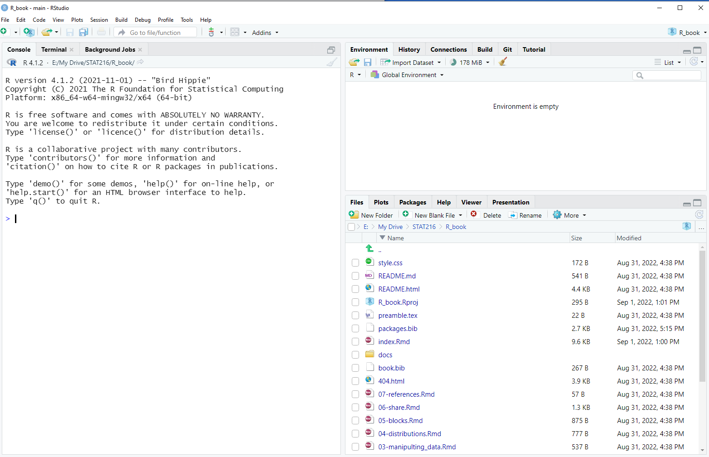

--- 
title: "R and RStudio for STAT216"
author: "Charles Katerba"
date: "Last update: `r Sys.Date()`"
site: bookdown::bookdown_site
documentclass: book
bibliography: [book.bib, packages.bib]
# url: your book url like https://bookdown.org/yihui/bookdown
# cover-image: path to the social sharing image like images/cover.jpg
description: |
  This is a minimal example of using the bookdown package to write a book.
  The HTML output format for this example is bookdown::gitbook,
  set in the _output.yml file.
link-citations: yes
github-repo: rstudio/bookdown-demo
---

```{r, echo = F, message=F, error=FALSE}
library(tidyverse)
```

# About

This 'book' is intended to be a quick and dirty introduction to R (a statistical programming language) and RStudio (an *integrated development environment*, or IDE, for R) for students in the introductory statistics class at Flathead Valley Community College. This book aims to introduce you to all of the features you'll need to use in R to be successful in the course.  Moreover, we hope that it will help you develop the tools you need to use R in your future endeavors.  This book is by no means a complete guide to everything one can do in R, but the aim is to cut down on content and theory in the name of practicality.   

This class will provide many students with their first interaction with computer programming. The coding required  is not extensive and the coding-based activities are heavily scaffolded. The point of including R in this course is not to introduce another layer of difficulty; the opposite is true in fact!  The goal is to give you a glimpse at how programming can make your life easier, at least when it comes to statistics and data science. In the process, you will hopefully add another useful and practical tool to your tool belt. Computers are not exiting our lives any time soon and being somewhat familiar with a little programming will only be an advantage. Some might say such familiarity will become essential. 

## Organization

The chapters of this book will be organized to follow the flow of STAT216 so that reading the book sequentially teaches you the tools as you need them in class. This book will almost certainly be a work in progress, so if there's something that you'd like to see or if you think something is missing, don't hesitate to reach out to the author (or your instructor if they are different people).   

## Getting started

The [programming language R](https://en.wikipedia.org/wiki/R_programming_language) is somewhat old, appearing first in 1993. That said, it is still quite useful and will remain so for a long time coming since it is an open-source programming language and software environment.  This means that the development and maintenance of the language and software are in the hands of all users, not just a small, select group of developers. Fear not! You will not have to do any developing. For our purposes, the open-source nature of R implies that the community of users will continue to grow the features and power of the language to meet the needs of the times.  

There are two mains ways to use R: through a cloud computing service or through an installation directly to your computer. The easiest way to start is through a cloud computing service. In both cases, we recommend you use the IDE *RStudio* as it makes using R more intuitive and straightforward. Below we describe how to use RStudio on the cloud and on your own computer.

1.  RStudio (which will rebrand as Posit in October 2022) hosts its own cloud computing service called [RStudio Cloud](https://rstudio.cloud/). To get started:

    - Click the previous link to access their website. 
    
    - Create a new account, for free. Your free account gives 25 project hours per month. This should be enough for your work in STAT216, but there's a chance you'll need more. There is a small fee in this case.
    
    - Click "Start a new project" in the top right corner of your browser. This will open an RStudio session for you.
    
    - Change the name of your project to something evocative to tell your future self what you were working on. Some ideas: STAT216 HW, STAT216 Activities, etc. 
    
    - You are now ready to rip!
    
2. You can also download a desktop version of RStudio. Accessing R in this way is slightly more involved, but offers more flexibility and no computational limitations. It is also free.  To install R to your own computer:

    - First, [you must install R](https://cran.rstudio.com/). This link takes you to CRAN, the Comprehensive R Archive Network, where you can download the latest version of R. Be sure to select the download appropriate to your operating system and follow the instructions provided at the link above. 
    
    - Next, [download and install RStudio Desktop](https://www.rstudio.com/products/rstudio/download/) following the directions at the link. Again, be sure to select the download appropriate to your operating sytem.  
    
    - You can now open RStudio by finding the application on your computer. You, too, are now ready to rip!
    
No matter what version of RStudio you are using, you should now see a window that looks something like this on your computer.




Before proceeding, notice that your RStudio session has 3 windows open.

1. **The console:** this is the most interactive window in your session. You can run quick calculations here. For example, type `2 + 2` then hit enter.  

2. **Files/plots window:** The files tab shows all of the files present in your current working directory.  We don't need to talk much about file management here and will cover it as needed in the future. When you make quick plots, they will appear under the plot tab. For example, evaluating
```{r}
plot(rnorm(10), rnorm(10))
```
in the console will produce a plot similar to the one above in the Plots panel. This little bit of code generates 2 collections of 10 random numbers and makes a scatter plot of the results. 


3. **Environment window:** This window displays the names of the objects you have stored in your computer's memory. As an example, if you evaluate `x <- rnorm(10)`, you will see the value `x` appear in the Environment tab. It is good to check the values you have stored when you're running into problems with your code.   

At this point, you can skim the rest of this chapter or move on to [RStudio basics].

## Code in this book

You should be able to copy and paste all code chunks in this book into your own RStudio terminal and reproduce the results you see in the book.  All data used in this book will be sourced from  base R, other commonly used packages, or appropriate links will be given for downloaded data sets. The author will endeavor to be clear about what packages are loaded and where data sets are coming from throughout the book.   

## Help

There are many avenues for finding help using R.  Your instructor, the STEM tutoring center, and the internet are great places to start. For the latter, you have to carefully phrase what you're asking, but if you do so, you can usually find great results with some clear examples. 

R also has a lot of built in help documentation.  You can access this documentation using a `?` before the name of the function/object that you're intereted in. For example, R has a function called `prop.test(...)` that we'll learn how to use in this class. To see R's documententation for `prop.test(...)`, simply run 

```{r, eval = FALSE}
?prop.test
```

in the console. The examples are usually helpful, but sometimes can create more confusion. In any case, this is a great place to start when you feel confused about a particular function or object.

If you bring up the documentation for an in-built data set, it will describe what the variables of that data set are. For instance, try running 

```{r, eval = FALSE}
?mtcars
```

in the console

## Debugging

In this class, you will very likely come to a point where some code you've written will not run.  This experience can be very frustrating. Remember, it happens to everyone and it frustrates everyone. Hadley Wickham provides a a detailed guide on  how to debug code in this book [Advanced R](https://adv-r.hadley.nz/debugging.html), but here is my take with a few additions. 

0. Double and triple check your syntax. New coders are often stymied by small syntax mistakes.  For instance, if you want to use a function called `f` in R, but you type `F` instead, the machine won't do the right thing. Similarly, be careful about commas; for example, elements of lists need to be separated by commas and they can be easy to forget. There are a too many syntax errors one can make to list here. 

1. Search the internet for the error codes you're seeing. You can simply copy and paste them into your web browser. Most likely someone before you has made the same mistake and asked the same question.

2. Figure out exactly where the error is. This is harder than it seems like it should be sometimes.  In short pieces of code it is usually easy to identify, but when you become more advanced and write longer code the problem can get tricky.

3. Reach out to your instructor and/or the STEM tutoring center at FVCC.  These people are invaluable resources.  Be sure to not only share the error code, but the entire chunk of code that you think is problematic. Even better, share all of your code. 

4. The website [CrossValidated](https://stats.stackexchange.com/) is a stack exchange where users can ask and answers questions about statistics, especially R coding. You may be able to get questions answered here, but be warned: the community is very picky about how you ask questions and about the type of questions you ask.

## Other resources

As mentioned above, these notes are only going to give you a brief glimpse of R and RStudio. The resources linked below will either provide a much more in-depth look at R and its applications or provide a very quick summary of certain packages and/or features. 

1.  [RStudio cheatsheets](https://www.rstudio.com/resources/cheatsheets/).  These are invaluable as they provide a lot of information in a small amount of space.

4. [A list of helpful R functions](https://sites.calvin.edu/scofield/courses/m143/materials/RcmdsFromClass.pdf). Thomas Scofield made a super consice list of commonly used base R functions and provided examples on how to use them. 

2. [R for Data Science](https://r4ds.had.co.nz/). As the title suggests, this book focuses more on data science than on statistics, so it spends more time on data visualization, programming, data wrangling, and modeling. 

3. [Advanced R](https://adv-r.hadley.nz/index.html). This book goes into the more nitty gritty details of programming in R. 

In writing this book the author has referenced many of the works above along with a collection of other resources.  See the bibliography for a somewhat complete list. 

<!-- You can render the HTML version of this example book without changing anything: -->

<!-- 1. Find the **Build** pane in the RStudio IDE, and -->

<!-- 1. Click on **Build Book**, then select your output format, or select "All formats" if you'd like to use multiple formats from the same book source files. -->

<!-- Or build the book from the R console: -->

<!-- ```{r, eval=FALSE} -->
<!-- bookdown::render_book() -->
<!-- ``` -->

<!-- To render this example to PDF as a `bookdown::pdf_book`, you'll need to install XeLaTeX. You are recommended to install TinyTeX (which includes XeLaTeX): <https://yihui.org/tinytex/>. -->

<!-- ## Preview book -->

<!-- As you work, you may start a local server to live preview this HTML book. This preview will update as you edit the book when you save individual .Rmd files. You can start the server in a work session by using the RStudio add-in "Preview book", or from the R console: -->

<!-- ```{r eval=FALSE} -->
<!-- bookdown::serve_book() -->
<!-- ``` -->


<!-- ```{r include=FALSE} -->
<!-- # automatically create a bib database for R packages -->
<!-- knitr::write_bib(c( -->
<!--   .packages(), 'bookdown', 'knitr', 'rmarkdown' -->
<!-- ), 'packages.bib') -->
<!-- ``` -->
